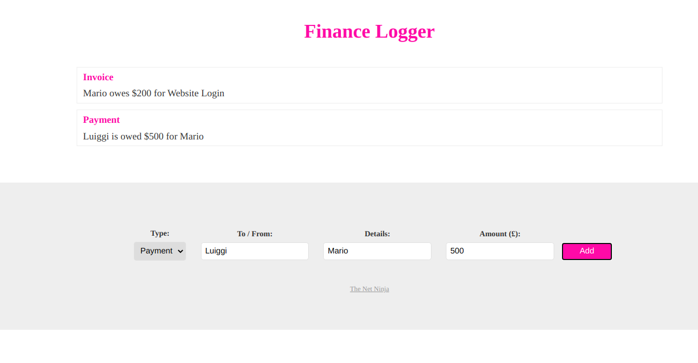

# Finnance-Logger 💸

<h1>
  
</h1>

## 🚀 About

This application was developed to study more about Typescript. It was based on [THIS](https://www.youtube.com/playlist?list=PL4cUxeGkcC9gUgr39Q_yD6v-bSyMwKPUI) tutorial. Here you can log the information of your finances, either is aa payment or an invoice.

### 📋 Precondition

This project needs Typescript installed in your machine.

## 🛠️ Tools

- [TS](https://www.typescriptlang.org/)
- [HTML](https://html5.org/)
- [JS](https://js.org/)

## 📝 License

This project is under the MIT license. See the file [LICENSE.md](LICE## 🛠️ Tools

- [NodeJS](https://nodejs.org)
- [HTML](https://html5.org/)
- [JS](https://js.org/)NSE) for more details.

---

Done by Levi Bernardelli Ciarrocchi ✌🏼

